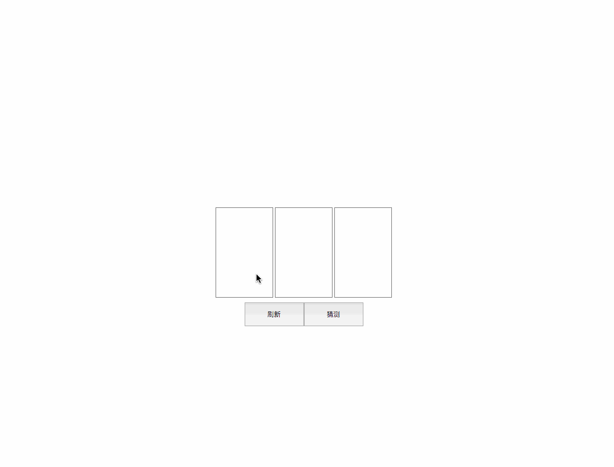

# 选择小游戏测验

这是一个类似扫雷的小游戏，你需要设计一个游戏面板，容纳 3 个卡片，玩家点击卡片，卡片会显示`marked`，再次点击会去掉该标志。玩家必须选择 2 个卡片，并为其`mark`，然后点击“猜测”按钮，查看结果。也可以点击“刷新”重新开一局游戏。

效果图如下：



## 开始测验

**获得习题**

```bash
#拉取代码
git clone https://github.com/DFocusFE/fe-practice.git

#进入习题
cd fe-practice/select-game

#安装依赖
npm install

#启动服务
npm start
```

> 然后你就可以在[http://localhost:3000](http://localhost:3000)看到自己的游戏雏形了，剩下的工作，就需要自己补全了哦

## 关于帮助

对于如何生成一个包含了随机“值”的 3 个卡片的数组，你可以直接使用

```javascript
import { createItems } from './utils/gameHelper'

console.log(createItems())
// [
//   { id: 0, isMarked: false, value: 'bingo' },
//   { id: 1, isMarked: false },
//   { id: 2, isMarked: false }
// ]
```

> 每次调用`createItems()`，都会生成一个新的随机数组
